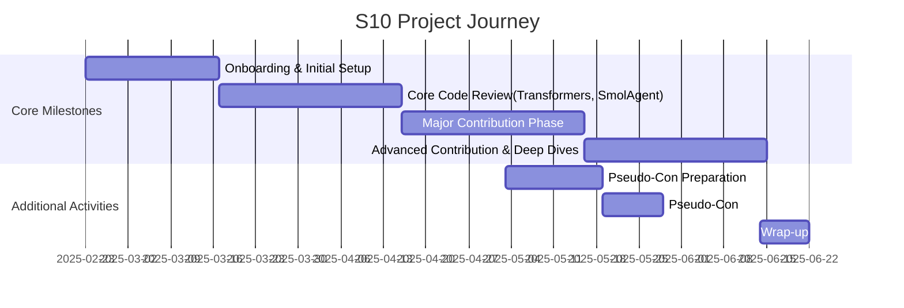

<div align="center">

</div>

<h1 align="center"> 🤗 Hugging Face Beyond First PR </h1>

<div align="center">
<a href="https://pseudo-lab.com"></a>
<a href="https://discord.gg/EPurkHVtp2"></a>
<a href="https://github.com/Pseudo-Lab/10th-template/stargazers"></a>
<a href="https://github.com/Pseudo-Lab/10th-template/network/members"></a>
<a href="https://github.com/Pseudo-Lab/10th-template/pulls"></a>
<a href="https://github.com/Pseudo-Lab/10th-template/issues"></a>
<a href="https://github.com/Pseudo-Lab/10th-template/graphs/contributors"></a>
<a href="https://hits.seeyoufarm.com"></a>
</div>

<!-- sheilds: https://shields.io/ -->
<!-- hits badge: https://hits.seeyoufarm.com/ -->

<h4 align="center">
<p>
<a href="https://github.com/Pseudo-Lab/Hugging-Face-Beyond-First-PR/blob/main/README.md">English</a> |
<a href="https://github.com/Pseudo-Lab/Hugging-Face-Beyond-First-PR/blob/main/README_ko.md">한국어</a>
<p>
</h4>

> Welcome to Hugging Face Beyond First PR repository! We aim to contribute directly to Hugging Face and its broader open-source ecosystem through hands-on coding and grow together as a community. Join us in advancing the field of Open-Source AI through open collaboration and innovation!

## 🌟 Project Vision
_"Beyond First PR"_  
- Contribute directly to Hugging Face and its ecosystem through hands-on coding!
- Improve various Hugging Face libraries, such as `transformers`, `smolagent`, and more!
- Expand contributions beyond Hugging Face libraries to external dependencies like `LangChain`, `MLflow`, `llama.cpp`, and others!

## 🤗 Hugging Face KREW

<div align="center">

</div>


**Hugging Face KREW** is the **research team of Pseudo Lab**, actively engaging in various study sessions and contribution activities related to Hugging Face. 🤗
In this 10th cohort, we are working on the following projects:
- [**Hugging Face Beyond First PR**](https://github.com/Pseudo-Lab/Hugging-Face-Beyond-First-PR?tab=readme-ov-file)  
- [**Hugging Face Hub Garden**](https://github.com/Pseudo-Lab/Hugging-Face-Hub-Garden)
- [**Hugging Face Cookbook Class Wars**](https://github.com/Pseudo-Lab/Hugging-Face-Cookbook-Class-Wars)

If you want to learn more about Hugging Face KREW, check out [this link](https://calm-book-46f.notion.site/Hugging-Face-KREW-146f51a7c11780c3a6bfc1b72e9fd65e?pvs=4)! 🚀✨

## 🧑 Team

| Role          | Name | Key Areas of Interest                          |
|---------------|------|----------------------------------------|
| **Project Manager** | Yijun Lee | Generative AI, Drug Discovery             |
| **Project Manager** | Evan Han | Generative AI, Quantization                   |


## 🚀 Project Roadmap



## 🛠️ Our Development Culture
```python
class CollaborationFramework:
    def __init__(self):
        self.tools = {
            'communication': 'Discord', 'Notion',
            'documentation': 'Notion',
            'version_control': 'GitHub Projects'
        }
    
    def workflow(self):
        return """Weekly Workflow:
        1️⃣ Meeting (Monday, 9 ~ 11 PM): Review weekly progress and share updates
        2️⃣ To-Do: Discuss and align on tasks for the week
        3️⃣ Contributions & Code Review: Work on contributions and review code"""
```


## 💻 Merged PR listing

- **Fixed VitDet for Non-Square Images** [#35969](https://github.com/huggingface/transformers/pull/35969) *(Transformers)*  
- **Add Gemma2 GGUF Support** [#34002](https://github.com/huggingface/transformers/pull/34002) *(Transformers)*  
- **Implemented auth_check** [#2497](https://github.com/huggingface/huggingface_hub/pull/2497) *(Hugging Face Hub)*  
- **Define Error** [#2444](https://github.com/huggingface/huggingface_hub/pull/2444) *(Hugging Face Hub)*  

## 😊 Activity Schedule

- **Online: Room-GH, every Monday at 9:00 PM**
- **The first meeting (March 10th) may be held in person, scheduled for 9:00 PM**

## 💡 Learning Resources  
- [First Contributions](https://github.com/firstcontributions/first-contributions): A beginner-friendly guide to making your first open-source contribution  
- [Transformers (GitHub)](https://github.com/huggingface/transformers): Hugging Face's state-of-the-art library for NLP and beyond  
- [Transformers (Docs)](https://huggingface.co/docs/transformers/index): Official documentation for using and contributing to the Transformers library  
- [smolagents (GitHub)](https://github.com/huggingface/smolagents): A lightweight agent framework for integrating LLMs into applications  
- [smolagents (Docs)](https://huggingface.co/docs/smolagents/index): Official documentation for SmolAgents, including usage and API details  


## 🌱 How to Engage
**To join as a team member, please apply during the runner recruitment period.**  
**If possible, please write about which library you want to contribute to and what kind of contributions you’d like to make. (Optional)**
- Link (Coming soon)

## Acknowledgement 🙏

Hugging Face Beyond First PR is developed as part of Pseudo-Lab's Open Research Initiative. Special thanks to our contributors and the open source community for their valuable insights and contributions.

## About Pseudo Lab 👋🏼</h2>

[Pseudo-Lab](https://pseudo-lab.com/) is a non-profit organization focused on advancing machine learning and AI technologies. Our core values of Sharing, Motivation, and Collaborative Joy drive us to create impactful open-source projects. With over 5k+ researchers, we are committed to advancing machine learning and AI technologies.

<h2>Contributors 😃</h2>
<a href="https://github.com/Pseudo-Lab/Hugging-Face-Beyond-First-PR/graphs/contributors">
  
</a>
<br><br>

<h2>License 🗞</h2>

This project is licensed under the [MIT License](https://opensource.org/licenses/MIT).
