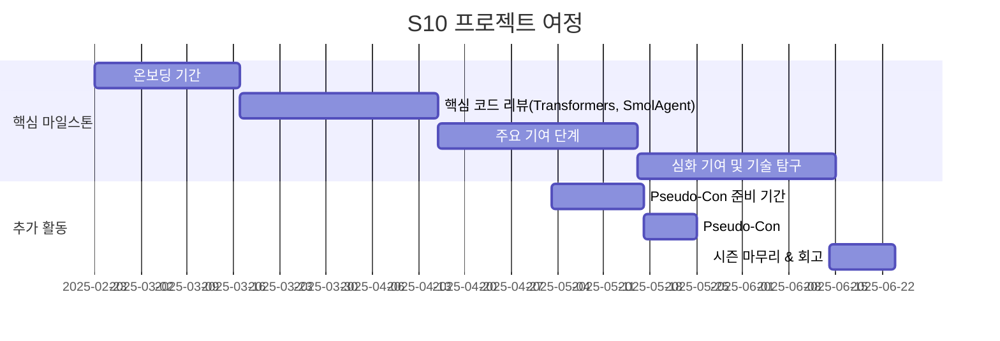

<div align="center">

</div>

<h1 align="center"> 🤗 Hugging Face Beyond First PR </h1>
<div align="center">
<a href="https://pseudo-lab.com"></a>
<a href="https://discord.gg/EPurkHVtp2"></a>
<a href="https://github.com/Pseudo-Lab/10th-template/stargazers"></a>
<a href="https://github.com/Pseudo-Lab/10th-template/network/members"></a>
<a href="https://github.com/Pseudo-Lab/10th-template/pulls"></a>
<a href="https://github.com/Pseudo-Lab/10th-template/issues"></a>
<a href="https://github.com/Pseudo-Lab/10th-template/graphs/contributors"></a>
<a href="https://hits.seeyoufarm.com"></a>
</div>

<h4 align="center">
<p>
<a href="https://github.com/Pseudo-Lab/Hugging-Face-Beyond-First-PR/blob/main/README.md">English</a> |
<a href="https://github.com/Pseudo-Lab/Hugging-Face-Beyond-First-PR/blob/main/README_ko.md">한국어</a>
<p>
</h4>

> **Hugging Face Beyond First PR**에 오신 것을 환영합니다!  
> 우리는 직접 Hugging Face 및 오픈소스 AI 생태계에 기여하는 것을 목표로 하며, 실전 코딩을 통해 함께 성장하는 커뮤니티를 지향합니다.  
> 오픈 협업과 혁신을 통해 AI 개발을 더 발전시키는 여정에 참여하세요!

---

## 🌟 프로젝트 비전
_"Beyond First PR"_  
- Hugging Face 및 관련 생태계에 직접 기여하기  
- `transformers`, `smolagent` 등 다양한 Hugging Face 라이브러리 개선  
- Hugging Face 라이브러리를 넘어 `LangChain`, `MLflow`, `llama.cpp` 등 외부 라이브러리에 기여  

---

## 🧑 팀 소개

| 역할             | 이름 | 관심 분야 |
|---------------|------|-----------------------------|
| **프로젝트 매니저** | 이이준 | Generative AI, Drug Discovery |
| **프로젝트 매니저** | 한철화 | Generative AI, Quantization |

---

## 🚀 프로젝트 로드맵


---

## 🛠️ 개발 문화
```python
class CollaborationFramework:
    def __init__(self):
        self.tools = {
            'communication': 'Google Meet', 'Notion',
            'documentation': 'Notion',
            'version_control': 'GitHub Projects'
        }
    
    def workflow(self):
        return """주간 개발 프로세스:
        1️⃣ 회의 (월요일, 오후 9시): 진행 상황 공유 및 리뷰
        2️⃣ 할 일 정리: 주간 계획 및 과제 정리
        3️⃣ 기여 & 코드 리뷰: 코드 기여 및 리뷰 진행"""
```

---

## 💻 기여한 PR 목록

- **Fixed VitDet for Non-Square Images** [#35969](https://github.com/huggingface/transformers/pull/35969) *(Transformers)*  
- **Add Gemma2 GGUF Support** [#34002](https://github.com/huggingface/transformers/pull/34002) *(Transformers)*  
- **Implemented auth_check** [#2497](https://github.com/huggingface/huggingface_hub/pull/2497) *(Hugging Face Hub)*  
- **Define Error** [#2444](https://github.com/huggingface/huggingface_hub/pull/2444) *(Hugging Face Hub)*  

---

## 💡 학습 자료
- [First Contributions](https://github.com/firstcontributions/first-contributions): 오픈소스 첫 기여를 위한 가이드  
- [Transformers (GitHub)](https://github.com/huggingface/transformers): Hugging Face의 NLP 라이브러리  
- [Transformers (문서)](https://huggingface.co/docs/transformers/index): 공식 문서 및 기여 가이드  
- [smolagents (GitHub)](https://github.com/huggingface/smolagents): LLM 기반 경량 AI 에이전트 프레임워크  
- [smolagents (문서)](https://huggingface.co/docs/smolagents/index): SmolAgents 공식 문서  

---

## 🌱 참여 방법
**팀원으로 참여하려면 러너 모집 기간에 지원해주세요!**  
**가능하다면, 어떤 라이브러리에 기여하고 싶으며, 어떤 방식으로 기여하고 싶은지 작성해 주세요. (선택)**
- 링크 (추후 업데이트 예정)

---

## 🙏 Acknowledgement

**Hugging Face Beyond First PR**은 **Pseudo-Lab Open Research Initiative**의 일부로 개발되었습니다.  
오픈소스 커뮤니티와 기여자 분들의 노력 덕분에 이 프로젝트가 가능했습니다! 🎉  

---

## 👋 Pseudo-Lab 소개

[Pseudo-Lab](https://pseudo-lab.com/)은 **비영리 단체**로, 머신러닝 및 AI 기술 발전을 목표로 합니다.  
우리는 **공유(Sharing), 동기부여(Motivation), 협업의 즐거움(Collaborative Joy)**을 핵심 가치로 삼아,  
5,000명 이상의 연구자와 함께 의미 있는 오픈소스 프로젝트를 만들어가고 있습니다. 🚀  

---

## 😃 기여자
<a href="https://github.com/Pseudo-Lab/Hugging-Face-Beyond-First-PR/graphs/contributors">
  
</a>
<br><br>

---

## 🗞 라이선스

이 프로젝트는 [MIT 라이선스](https://opensource.org/licenses/MIT)로 제공됩니다.  
